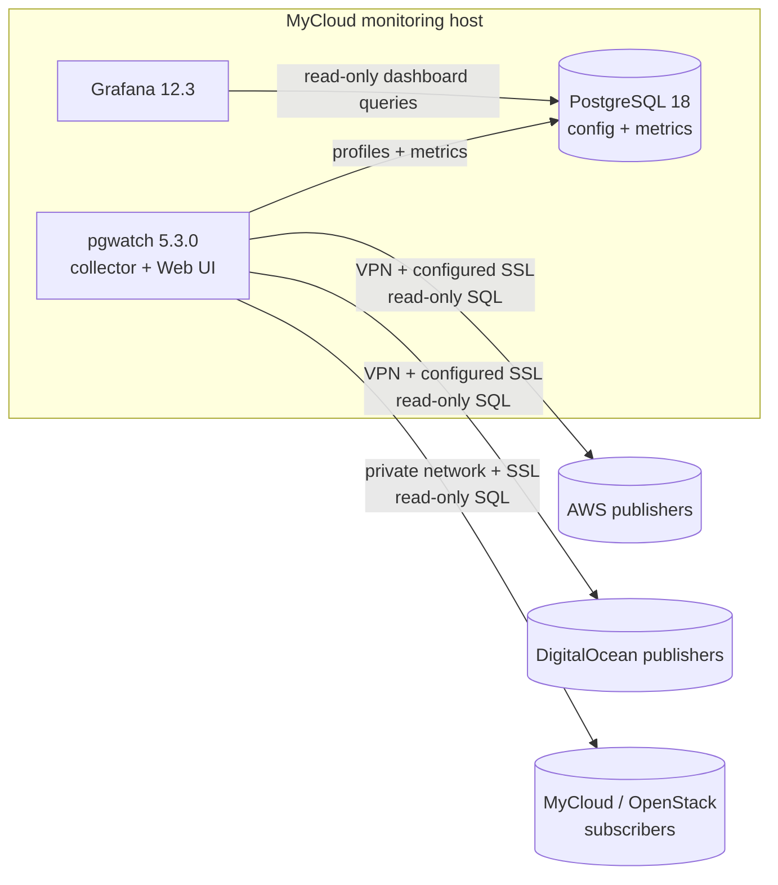

# PostgreSQL Logical Replication Migration Monitoring

A monitoring-only pgwatch stack for many logical-replication migrations from
AWS or DigitalOcean PostgreSQL into MyCloud (OpenStack). A native pgwatch Web
UI manages database profiles, one private PostgreSQL 18 container stores both
configuration and metrics in separate logical databases, and Grafana provides
fleet and detail dashboards.

No query in this project drops, alters, resets, vacuums, or otherwise changes a
publisher or subscriber. Profile connection strings should enforce
`default_transaction_read_only=on`, a 5-second statement timeout, and a
1-second lock timeout.

## Architecture



Grafana binds to `GRAFANA_BIND_ADDRESS`, which defaults to `127.0.0.1`.
The pgwatch administrative UI binds to `PGWATCH_WEB_BIND_ADDRESS`, also
loopback by default, and requires its own username and password. The internal
database has no host port. The Docker bridge is not marked internal because
pgwatch must reach databases over the AWS, DigitalOcean, and MyCloud networks.

## Version assumptions

This project was checked on 2026-09-15 against the current stable pgwatch
release, **v5.3.0**. It deliberately does not use the archived pgwatch2 format
or the v6 beta. It uses the v5 PostgreSQL source store and YAML metric format,
the supported `cybertecpostgresql/pgwatch:5.3.0` image, Grafana 12.3, and
`postgres:18.6-alpine` for internal configuration and metrics.

Validation detects and prints each server's reported PostgreSQL version; it
does not reject a connection based only on the major version. Custom metric
SQL currently starts with PostgreSQL 17 catalog layouts and includes
PostgreSQL 18 variants for newer conflict counters. The validator executes the
queries against the connected servers, so an actually incompatible catalog
layout is reported as a SQL failure instead of a version allowlist failure.

References: [pgwatch v5.3.0 release](https://github.com/cybertec-postgresql/pgwatch/releases/tag/v5.3.0),
[pgwatch CLI/environment reference](https://pgwat.ch/latest/reference/cli_env/),
[PostgreSQL 17 replication-slot view](https://www.postgresql.org/docs/17/view-pg-replication-slots.html),
and [PostgreSQL 18 subscription statistics](https://www.postgresql.org/docs/18/monitoring-stats.html#MONITORING-PG-STAT-SUBSCRIPTION-STATS).

## Prerequisites

- Docker Engine with Docker Compose v2
- `psql`, `curl`, and `jq` on the monitoring host
- Python 3 and GNU `stdbuf` for the optional exact data validator
- Network access from the monitoring host to both PostgreSQL endpoints
- A CA certificate for each endpoint when using `verify-ca` or `verify-full`;
  `verify-full` also requires the certificate to match the configured host
- An administrator able to create the monitoring role on each cluster
- Existing publications, subscriptions, and slots; this project never creates
  or changes replication configuration

## Create the least-privilege monitoring role

Run these commands as an authorized administrator once on the **source
cluster** and once on the **target cluster**. Replace the password and database
name. Repeat only the `GRANT CONNECT` for each database monitored by that
cluster role.

```sql
CREATE ROLE pgwatch_monitor
  LOGIN
  PASSWORD '<LONG_RANDOM_PASSWORD>'
  NOSUPERUSER
  NOCREATEDB
  NOCREATEROLE
  NOREPLICATION;

GRANT pg_monitor TO pgwatch_monitor;
GRANT CONNECT ON DATABASE "appdb" TO pgwatch_monitor;
```

No superuser, replication attribute, ownership, schema privilege, or table
write privilege is needed. `pg_monitor` is needed to see complete statistics
for other backends, including WAL senders and subscription workers.
`pg_subscription.subconninfo` is intentionally never queried.

On a hardened installation that has revoked the normal public catalog access,
first run `./scripts/validate.sh` and inspect the exact permission error.
Only then consider narrow `SELECT` grants on the named system views/catalogs;
do not grant superuser, replication, database ownership, or broad application
schema access.

## Create the one-shot data-validation role

pgwatch itself does not compare application rows. For an exact post-migration
comparison, create a separate role on the source and target so continuous
monitoring never gains access to application data:

```sql
CREATE ROLE migration_validator
  LOGIN
  PASSWORD '<DIFFERENT_LONG_RANDOM_PASSWORD_ON_EACH_CLUSTER>'
  NOSUPERUSER
  NOCREATEDB
  NOCREATEROLE
  NOREPLICATION;

GRANT pg_monitor TO migration_validator;
GRANT CONNECT ON DATABASE "appdb" TO migration_validator;
GRANT USAGE ON SCHEMA app TO migration_validator;
GRANT SELECT ON TABLE app.example_table TO migration_validator;
```

Grant `USAGE` and `SELECT` only for the schemas and tables in the publication.
The validator fails closed if a table is unreadable; it never grants or changes
database privileges itself. Revoke or remove this role after validation under
your normal access-control process.

## Configure

```bash
cd pgwatch-logical-replication
cp .env.example .env
chmod 600 .env
```

Create the shared passfile referenced by `DB_PGPASSFILE_HOST` with one exact
entry for every monitoring profile:

```text
aws-publisher.example.com:5432:orders:pgwatch_monitor:<AWS_ORDERS_PASSWORD>
openstack-subscriber.example.com:5432:orders:pgwatch_monitor:<MYCLOUD_ORDERS_PASSWORD>
do-publisher.example.com:5432:wallet:pgwatch_monitor:<DO_WALLET_PASSWORD>
openstack-subscriber-02.example.com:5432:wallet:pgwatch_monitor:<MYCLOUD_WALLET_PASSWORD>
```

Add separate `migration_validator` entries only for a pair that will use the
exact cutover comparison. Host, port, database, and username must exactly match
the passwordless connection string saved in the Web UI; avoid wildcards.
Escape `:` and `\` with a backslash as described in the
[PostgreSQL password-file documentation](https://www.postgresql.org/docs/current/libpq-pgpass.html).
Protect the file before starting the stack:

```bash
chmod 600 /absolute/path/to/.pgpass
```

Edit `.env`. Set `DB_PGPASSFILE_HOST`, unique internal PostgreSQL, Grafana,
and pgwatch Web UI passwords, and keep both web bind addresses on loopback for
the first trial. `SOURCE_DB_*` and `TARGET_DB_*` now describe only the
optional pair checked by `validate.sh` and `validate-data.sh`; they no longer
control continuous monitoring.

All hosts, addresses, usernames, and passwords in tracked files are examples.
Keep real values in the ignored `.env` and passfile, or in pgwatch's Web UI;
never add them to `README.md` or `config/sources.yaml`.

Put any CA certificates used by profiles in `DB_CERTS_DIR_HOST`. That
directory is mounted read-only at `/run/pgwatch-certs`. Certificate contents
are ignored by Git.

The scripts source `.env` as shell syntax. Single-quote values containing
`$`, `#`, spaces, or other shell metacharacters. A literal single quote in
a secret should be avoided or escaped using normal shell syntax. External
database passwords belong only in the shared passfile, not in `.env`, the
Web UI, connection strings, or the pgwatch configuration database.

The passfile is mounted read-only at `/run/pgwatch-secrets/pgpass`. Keep it
dedicated to this project and add an exact entry for each monitored database.

Every Web UI profile selects its own PostgreSQL SSL mode:

- `verify-full`: encrypted, with CA and hostname verification.
- `verify-ca`: encrypted, with CA verification only.
- `require`: encrypted, without server identity verification.
- `prefer`, `allow`, or `disable`: encryption is not guaranteed.

Prefer `verify-full`. For verification modes, reference the mounted path such
as `/run/pgwatch-certs/aws-ca.pem`. Traffic to the unexposed internal database
stays on the private Docker bridge and uses `sslmode=disable`.

## Start

```bash
sudo ./scripts/start.sh
```

Omit `sudo` when the current account can access the Docker socket. Use this
launcher instead of a direct `docker compose up`: it builds the internal
connection URIs, creates the private `pgwatch_config` database, initializes
pgwatch's configuration schema, and then starts all services. Metrics remain
in the separate `pgwatch_metrics` database. The source registry starts empty.

Do not continue to Web UI setup if the launcher exits with an error. Re-running
it is safe; existing configuration and metric data are kept.

## Manage database profiles

Keep the management console on loopback and open it from your Mac:

```bash
ssh -N -L 8080:127.0.0.1:8080 user@monitor.example.com
```

After authentication this command deliberately prints nothing and keeps the
terminal occupied while the tunnel is active. Leave it running, or use
`ssh -fN -L 8080:127.0.0.1:8080 user@monitor.example.com` to put it in the
background. `Ctrl-C` closes a foreground tunnel.

Open <http://127.0.0.1:8080>, sign in with `PGWATCH_WEB_USER` and
`PGWATCH_WEB_PASSWORD` from `.env` (not the SSH password), and use **Sources**
to create two explicit profiles for every replicated database:

- Publisher: AWS or DigitalOcean database.
- Subscriber: corresponding MyCloud (OpenStack) database.

For each profile:

1. Add a source with a unique name.
2. Set kind to `postgres`, group to `logical-replication`, and enable it.
3. Enter the passwordless connection string.
4. Enter the role-specific custom tags and custom metrics shown below.
5. Test the connection from the Web UI, then save.

Use this publisher connection string as a template:

```text
postgresql://pgwatch_monitor@aws-publisher.example.com:5432/orders?sslmode=verify-full&sslrootcert=/run/pgwatch-certs/aws-ca.pem&passfile=/run/pgwatch-secrets/pgpass&application_name=pgwatch-logical&options=-cdefault_transaction_read_only%3Don%20-cstatement_timeout%3D5s%20-clock_timeout%3D1s
```

Choose `require` and omit `sslrootcert` when encryption without CA
verification is the strongest mode currently available. The Web UI's
connection test runs inside the pgwatch container, so it uses the mounted
passfile and certificates. DNS names and container paths must therefore work
inside pgwatch rather than only on the Mac or VM host.

pgwatch v5.3 invalidates Web UI sessions whenever its container restarts. If a
page spins after a restart, open the root URL in an incognito window and sign
in again.

Give both sides the same unique `migration_pair`. Example custom tags:

```json
{"provider":"aws","instance":"aws-publisher-01","environment":"production","migration_role":"publisher","migration_pair":"orders-migration-01"}
```

The MyCloud side changes `provider`, `instance`, and `migration_role`:

```json
{"provider":"mycloud","instance":"openstack-subscriber-01","environment":"production","migration_role":"subscriber","migration_pair":"orders-migration-01"}
```

Set `instance` to the human-readable cloud instance or endpoint name. PostgreSQL
cannot report the DNS name used by its client, so the dashboard also shows the
server IP and port detected independently by each database connection.

Configure publisher custom metrics as
`{"source_replication_slot":10,"source_publication":30,"instance_up":60,"general_database":60}`.
Configure subscriber custom metrics as
`{"target_subscription":10,"target_subscription_errors":15,"target_table_sync":30,"target_replication_origins":30,"instance_up":60,"general_database":60}`.
The complete pair is also shown in `config/sources.yaml` as a non-active
reference. Saved profiles persist in the `metrics-data` volume. Wait five
minutes after saving the first pair before validating dashboards and fresh
metric rows.

Loopback is the safe default. To expose the Web UI only on the VM's private
interface instead, replace the example private address below and restart with
`sudo ./scripts/start.sh`:

```env
PGWATCH_WEB_BIND_ADDRESS=10.0.0.10
PGWATCH_WEB_PORT=8080
```

Restrict that port to the VPN or trusted client addresses. Different Ubuntu
users do not isolate TCP ports: two services can use port 8080 only when they
bind different IP addresses. Do not expose the password-based Web UI over
unencrypted public HTTP; use the SSH tunnel or a secured HTTPS reverse proxy.

The exact sampling intervals are:

| Metric | Interval |
|---|---:|
| Publisher logical slots, byte lag, retained WAL | 10 seconds |
| Publisher publication status and table count | 30 seconds |
| Subscriber worker health and message age | 10 seconds |
| Apply/sync errors and PG18 conflicts | 15 seconds |
| Table synchronization state | 30 seconds |
| Replication origins | 30 seconds |
| Lightweight connectivity/general database totals | 60 seconds |

pgwatch is limited to one parallel connection per monitored database and
helper creation is disabled. Retention defaults to 30 days.

## Access Grafana

The safe default remains <http://127.0.0.1:3000>. To bind Grafana to the
requested VM address, set this in `.env` and restart the stack:

```env
GRAFANA_BIND_ADDRESS=10.0.0.10
```

Then open <http://10.0.0.10:3000> over the VPN and log in with
`GRAFANA_ADMIN_USER` / `GRAFANA_ADMIN_PASSWORD`. The pgwatch administrative
UI stays loopback-only.

Docker cannot bind a public DNS or NAT endpoint such as `monitor.example.com`
unless its resolved address is assigned to the VM; public access otherwise
requires upstream NAT/port forwarding or a reverse proxy. Keep TCP port 3000
restricted to trusted VPN or client addresses. If the connection is not
protected by the VPN, keep
`GRAFANA_BIND_ADDRESS=127.0.0.1` and use an SSH tunnel:

```bash
ssh -L 3000:127.0.0.1:3000 user@monitor.example.com
```

Two dashboards are under **PostgreSQL Migrations**:

- **PostgreSQL Migration Fleet Overview** lists every correlated migration as
  `source instance → target instance`, database, latest lag in bytes, new
  errors in the last five minutes, table readiness, and cutover status. Click a
  database name to open the matching detail dashboard.
- **PostgreSQL Logical Replication Migration** provides detailed charts and
  publication/table status tables. Its visible selectors are Source database,
  Target database, and Slot; the matching subscription is resolved automatically.
  The dashboard is split into Source on the left and Target on the right. Its two
  identity tables show database, configured instance, detected server endpoint,
  and PostgreSQL version. Source and target database-size tables appear below
  the corresponding health and replication panels. Snapshot tables hide
  rows older than five minutes so stopped collection is shown as no data rather
  than as current state.

The detail dashboard shows continuous `HEALTHY`, `WARNING`, `CRITICAL`, or
`UNKNOWN` status from fresh slot, worker, lag, table-readiness, and five-minute
apply/sync error data. Its cutover status is stricter: `READY` requires healthy
synchronized replication, zero lag and new errors, all tables ready, and the
latest exact data comparison to be `PASS`. Until that comparison is recorded it
shows `DATA CHECK REQUIRED`; a failed comparison shows `DATA CHECK FAILED`.
The fleet overview applies the same equality gate.

Eight suggested alert rules are provisioned **paused**, with no contact point.
They cover inactive required slots, missing apply workers, a combined
apply-plus-sync error increase greater than five in five minutes, 10/20 GiB
retained WAL, 1 GiB lag, 60-second message age, and a non-ready count unchanged
for 15 minutes. Review their scope and
notification routing before enabling them. Rules tied to subscriptions filter
on `subenabled`; an intentionally disabled subscription will not trigger
those rules.

## Validate

```bash
sudo ./scripts/validate.sh
```

Omit `sudo` when the current account can access the Docker socket. Run
validation after every profile change and after the five-minute initial
collection window.

Validation is read-only. It checks all three services, prints the detected
source and target versions, checks connectivity, runs all six standalone SQL
files, and verifies the Grafana datasource, dashboards, paused alerts, and
fresh metric rows. During a run it allows up to two additional minutes for
individual metric tables to receive fresh rows.

## Compare source and target data at cutover

The exact validator compares only full-row published tables with matching
schemas and primary keys. It does not put application rows in pgwatch, Grafana,
or the metrics database.

Set `VALIDATION_MIGRATION_PAIR` in `.env` to the same value used by both
profiles' `migration_pair` tags. Run the command, then follow its write-pause
prompt:

```bash
sudo ./scripts/validate-data.sh
```

The workflow is:

1. Preflight publication membership, subscription readiness, schemas, primary
   keys, and read privileges.
2. Pause and drain application writes, then type `PAUSED`.
3. The validator captures a source snapshot and cutoff LSN, waits for the
   subscriber to apply through that LSN, and captures a target snapshot.
4. When `SNAPSHOTS CAPTURED` appears, application writes may resume. Keep the
   validator running while it streams both stable snapshots.

For automation, pause writes first and use `--writes-paused`. Override the
default five-minute catch-up wait with `--catchup-timeout SECONDS` and the
report location with `--output PATH`. Omit `sudo` when the current account
can access the Docker socket.

Reports are owner-only JSON Lines files under `validation-reports/`. They
contain table names, primary keys, mismatch types, and changed column names,
but never differing values. The wrapper also records only the final
`PASS`, `FAIL`, or `ERROR` status and aggregate row counts in the internal
metrics database so Grafana can gate cutover readiness; application values are
never stored there. Exit status `0` means equal, `1` means confirmed
row differences, and `2` means the comparison was incomplete or invalid.

This validates published table rows only. PostgreSQL logical replication does
not replicate DDL, sequence state, or large objects; audit those separately
before cutover. Keep target application writes disabled until migration
ownership transfers, or the comparison no longer represents replication alone.

## Add another database

Each pgwatch source is one database connection. For another migration pair:

1. Grant `CONNECT` on both databases to `pgwatch_monitor`.
2. Add exact passfile entries for the publisher and subscriber; add
   validation-user entries too when exact comparison will be used.
3. Put any required CA file in `DB_CERTS_DIR_HOST`.
4. In the pgwatch Web UI, create uniquely named publisher and subscriber
   profiles with the role-specific custom metrics.
5. Give both profiles the same new `migration_pair` and the appropriate
   `provider`, `instance`, and `migration_role` tags.
6. Test each connection in the UI, save both profiles, wait for the refresh
   interval, and run `./scripts/validate.sh`.

Do not reuse a pgwatch `name`; it becomes the `dbname` label in the metrics
sink. The dashboard automatically discovers additional names. Keep one shared
stack unless a network or security boundary requires separate collectors.

## Troubleshoot the Web UI or missing metrics

If the Web UI shell loads but **Sources** keeps spinning, check the service
before changing browser or network settings:

```bash
sudo ./scripts/validate.sh
sudo docker compose --env-file .env ps -a pgwatch
sudo docker compose --env-file .env logs --since=10m pgwatch
```

- `pgwatch Web UI authentication failed` means the configured bind address is
  unreachable or the running container has different credentials. Confirm
  `PGWATCH_WEB_BIND_ADDRESS`, restart with `sudo ./scripts/start.sh`, and sign
  in again from an incognito window.
- `relation "pgwatch.source" does not exist` means the configuration schema is
  missing from the database used by the running container. Run
  `sudo ./scripts/start.sh`; do not delete volumes or create the table by hand.
- Empty `ps` and log output means no pgwatch container exists. Run the launcher
  and address its first error before running validation.
- Check a listener with `sudo ss -ltnp 'sport = :8080'`. A port conflict
  prevents the whole container from starting; it cannot break only the
  Sources tab.

For profile or metric failures:

1. Run `sudo ./scripts/validate.sh`; it reports the failing layer.
2. Check `sudo docker compose --env-file .env logs --since=10m pgwatch`
   without posting logs that may contain connection details.
3. Confirm `DB_PGPASSFILE_HOST` points to a readable mode-`0600` file and
   that its host, port, database, and username fields match the Web UI profile.
4. Verify DNS, firewall rules, and pg_hba.conf access for the monitoring role.
   For certificate verification modes, also check the CA path and certificate
   hostname.
5. Confirm `GRANT CONNECT` exists on the specific database and
   `pg_monitor` is granted.
6. Confirm a logical slot/subscription/table relation/origin actually exists.
   Empty system views legitimately produce no rows for that metric.
7. Check the metrics sink tables:

```bash
sudo docker compose --env-file .env exec -T metrics-db \
  sh -c 'psql -U "$POSTGRES_USER" -d "$POSTGRES_DB" -c "\dt"'
```

8. Check provisioning logs with
   `sudo docker compose --env-file .env logs --since=10m grafana`.

## Stop and clean up

Stop containers while preserving Grafana and metric history:

```bash
./scripts/stop.sh
```

Remove the monitoring containers, network, and the two monitoring-only volumes:

```bash
docker compose --env-file .env down --volumes
```

After the stack is down, it is safe to delete this project directory, its
`.env`, dashboard/configuration files, CA-file copies used only by this
monitoring host, a passfile created only for this project, and the Compose
volumes `metrics-data` and `grafana-data`.
Deleting the volumes permanently removes monitoring history, the pgwatch
source-profile registry, and Grafana state. Export or record profiles before
removing `metrics-data`.

**Never delete or change anything on PostgreSQL as part of cleanup.** In
particular, do not drop replication slots, publications, subscriptions,
replication origins, or the application databases; do not reset replication
statistics; do not alter/enable/disable subscriptions; do not change server
parameters; and do not restart PostgreSQL. Removing `pgwatch_monitor` is a
separate access-control decision and is not performed by these scripts.

## Known limitations

- Slot lag is a WAL byte distance, not transaction latency.
- `safe_wal_size = -1` represents PostgreSQL NULL (unbounded/unavailable).
- Origin counts/activity cover only the current database's subscription-managed
  `pg_<subscription_oid>` naming convention; PostgreSQL exposes origin
  progress but no universal active flag.
- A long-running table copy can keep the non-ready count unchanged and make
  the paused stagnation rule a false positive.
- Correlation assumes the target `subslotname` matches the publisher slot
  name and both sources share the correct `migration_pair` tag.
- Client certificates are not added automatically; place them in the ignored
  certificate directory and add container-side `sslcert`/`sslkey` paths to
  that profile when mutual TLS is required.
- Grafana and pgwatch UI are loopback-only; remote access needs an SSH tunnel
  or a separately secured reverse proxy.
- Exact data validation supports one full-row publication whose tables all have
  primary keys; row filters, column lists, keyless tables, DDL, sequences, and
  large objects are intentionally outside its scope.
