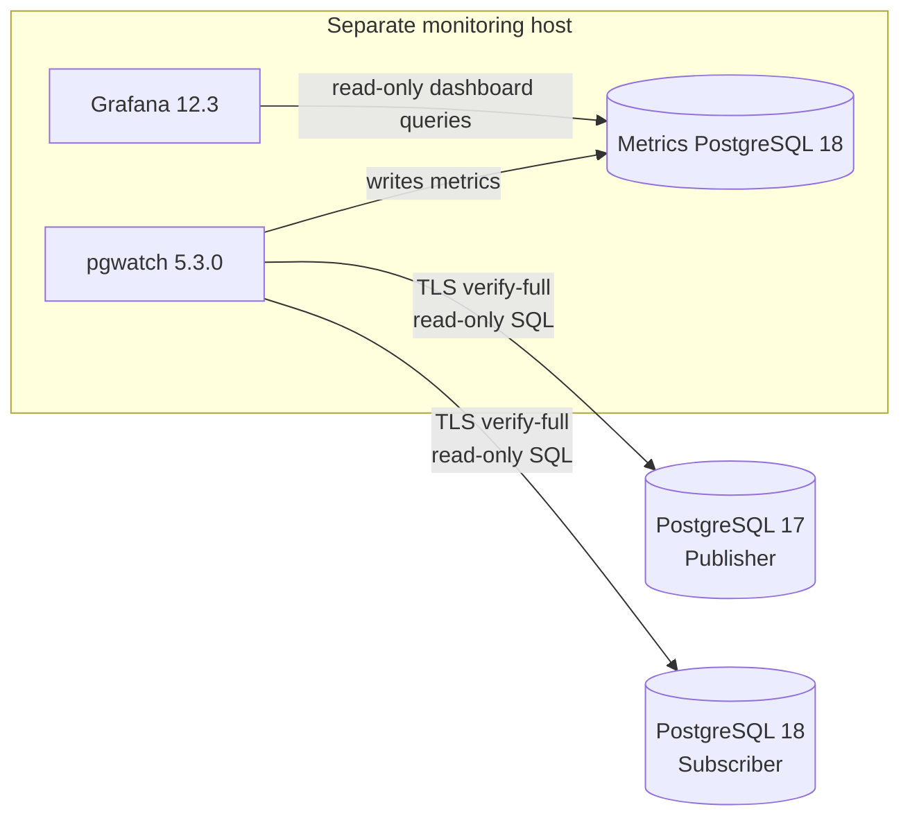

# PostgreSQL Logical Replication Migration Monitoring

A monitoring-only pgwatch stack for a PostgreSQL 17 publisher and PostgreSQL 18
subscriber. It runs on a separate host, stores metrics in a private PostgreSQL
18 container, and provisions Grafana with the dashboard **PostgreSQL Logical
Replication Migration**.

No query in this project drops, alters, resets, vacuums, or otherwise changes a
publisher or subscriber. Source and target connections enforce
`default_transaction_read_only=on`, a 5-second statement timeout, and a
1-second lock timeout.

## Architecture



Only Grafana and the pgwatch web UI bind to the host, and both bind to
`127.0.0.1`. The metrics database has no host port. The Docker bridge is not
marked internal because pgwatch must reach the external database servers.

## Version assumptions

This project was checked on 2026-09-15 against the current stable pgwatch
release, **v5.3.0**. It deliberately does not use the archived pgwatch2 format
or the v6 beta. It uses the v5 YAML source and metric format, the supported
`cybertecpostgresql/pgwatch:5.3.0` image, Grafana 12.3, and
`postgres:18.6-alpine` for the internal sink.

Metric SQL has explicit PostgreSQL 17 and 18 variants. PostgreSQL 18 conflict
counters in `pg_stat_subscription_stats` are collected only by the v18
variant. PostgreSQL 17 publisher slot columns include `wal_status`,
`safe_wal_size`, `invalidation_reason`, `failover`, and `synced`.

References: [pgwatch v5.3.0 release](https://github.com/cybertec-postgresql/pgwatch/releases/tag/v5.3.0),
[pgwatch CLI/environment reference](https://pgwat.ch/latest/reference/cli_env/),
[PostgreSQL 17 replication-slot view](https://www.postgresql.org/docs/17/view-pg-replication-slots.html),
and [PostgreSQL 18 subscription statistics](https://www.postgresql.org/docs/18/monitoring-stats.html#MONITORING-PG-STAT-SUBSCRIPTION-STATS).

## Prerequisites

- Docker Engine with Docker Compose v2
- `psql`, `curl`, and `jq` on the monitoring host
- Network access from the monitoring host to both PostgreSQL endpoints
- A CA certificate for each endpoint whose certificate matches
  `SOURCE_DB_HOST` or `TARGET_DB_HOST`
- An administrator able to create the monitoring role on each cluster
- Existing publications, subscriptions, and slots; this project never creates
  or changes replication configuration

## Create the least-privilege monitoring role

Run these commands as an authorized administrator once on the **source
cluster** and once on the **target cluster**. Replace the password and database
name. Repeat only the `GRANT CONNECT` for each database monitored by that
cluster role.

```sql
CREATE ROLE pgwatch_monitor
  LOGIN
  PASSWORD '<LONG_RANDOM_PASSWORD>'
  NOSUPERUSER
  NOCREATEDB
  NOCREATEROLE
  NOREPLICATION;

GRANT pg_monitor TO pgwatch_monitor;
GRANT CONNECT ON DATABASE "appdb" TO pgwatch_monitor;
```

No superuser, replication attribute, ownership, schema privilege, or table
write privilege is needed. `pg_monitor` is needed to see complete statistics
for other backends, including WAL senders and subscription workers.
`pg_subscription.subconninfo` is intentionally never queried.

On a hardened installation that has revoked the normal public catalog access,
first run `./scripts/validate.sh` and inspect the exact permission error.
Only then consider narrow `SELECT` grants on the named system views/catalogs;
do not grant superuser, replication, database ownership, or broad application
schema access.

## Configure

```bash
cd pgwatch-logical-replication
cp .env.example .env
chmod 600 .env
```

Edit `.env`. Set real source/target hosts, database names, monitoring
credentials, unique internal/Grafana passwords, and absolute readable CA paths.
The non-secret `migration_pair` values in `config/sources.yaml` correlate
the publisher and subscriber. Use a unique shared value for each migration
pair. pgwatch v5.3 expands environment variables in source names and
connection strings, but not in `custom_tags`, so this label is intentionally
set in YAML.

The scripts source `.env` as shell syntax. Single-quote values containing
`$`, `#`, spaces, or other shell metacharacters. A literal single quote in
a secret should be avoided or escaped using normal shell syntax. The startup
script URL-encodes all DSN components; credentials are never stored in the
checked-in YAML.

TLS verification for source and target is mandatory. Do not change
`sslmode=verify-full` merely to bypass certificate problems. Traffic inside
the local Docker bridge uses `sslmode=disable`; that database is not exposed
on a host port.

## Start

```bash
./scripts/start.sh
```

The exact sampling intervals are:

| Metric | Interval |
|---|---:|
| Publisher logical slots, byte lag, retained WAL | 10 seconds |
| Subscriber worker health and message age | 10 seconds |
| Apply/sync errors and PG18 conflicts | 15 seconds |
| Table synchronization state | 30 seconds |
| Replication origins | 30 seconds |
| Lightweight connectivity/general database totals | 60 seconds |

pgwatch is limited to one parallel connection per monitored database and
helper creation is disabled. Retention defaults to 30 days.

## Access Grafana

Open <http://127.0.0.1:3000> on the monitoring host and log in with
`GRAFANA_ADMIN_USER` / `GRAFANA_ADMIN_PASSWORD`. If accessing remotely,
use an SSH tunnel rather than widening the bind address:

```bash
ssh -L 3000:127.0.0.1:3000 monitoring-host
```

The dashboard is under **PostgreSQL Migrations**. Choose publisher, subscriber,
subscription, and slot from the dashboard variables.

Nine suggested alert rules are provisioned **paused**, with no contact point.
They cover inactive required slots, missing apply workers, increasing
apply/sync errors, 10/20 GiB retained WAL, 1 GiB lag, 60-second message age,
and a non-ready count unchanged for 15 minutes. Review their scope and
notification routing before enabling them. Rules tied to subscriptions filter
on `subenabled`; an intentionally disabled subscription will not trigger
those rules.

## Validate

```bash
./scripts/validate.sh
```

Validation is read-only. It checks all three services, exact database major
versions, source/target connectivity, all five standalone SQL files, the
Grafana datasource and dashboard, paused alerts, and fresh metric rows. Allow
up to two minutes for the first metric validation.

## Add another database

Each pgwatch source is one database connection. For another migration pair:

1. Add uniquely named source/target variables to `.env`.
2. Export two additional URL-encoded connection strings in
   `scripts/start.sh`, following the existing `build_db_uri` calls.
3. Append publisher and subscriber entries to `config/sources.yaml`, using
   unique `name` values and the new connection-string variables.
4. Give both entries the same new `migration_pair` tag.
5. Grant `CONNECT` on each added database to `pgwatch_monitor`.
6. Restart only the monitoring stack and validate.

Do not reuse a pgwatch `name`; it becomes the `dbname` label in the metrics
sink. The dashboard automatically discovers additional names. If many
databases are migrated, consider one migration pair per Compose project to
keep credentials and failure domains isolated; set a unique Compose project
name and host ports for each.

## Troubleshoot missing metrics

1. Run `./scripts/validate.sh`; it reports the failing layer.
2. Check `docker compose logs --since=10m pgwatch` without posting logs that
   may contain connection details.
3. Verify DNS, firewall rules, CA paths, certificate hostnames, and
   `pg_hba.conf` access for `pgwatch_monitor`.
4. Confirm `GRANT CONNECT` exists on the specific database and
   `pg_monitor` is granted.
5. Confirm a logical slot/subscription/table relation/origin actually exists.
   Empty system views legitimately produce no rows for that metric.
6. Check the metrics sink tables:

```bash
docker compose exec -T metrics-db psql -U "${METRICS_DB_USER}" \
  -d "${METRICS_DB_NAME}" -c '\dt'
```

7. Check provisioning logs with
   `docker compose logs --since=10m grafana`.

## Stop and clean up

Stop containers while preserving Grafana and metric history:

```bash
./scripts/stop.sh
```

Remove the monitoring containers, network, and the two monitoring-only volumes:

```bash
docker compose --env-file .env down --volumes
```

After the stack is down, it is safe to delete this project directory, its
`.env`, dashboard/configuration files, CA-file copies used only by this
monitoring host, and the Compose volumes `metrics-data` and `grafana-data`.
Deleting the volumes permanently removes only monitoring history and Grafana
state.

**Never delete or change anything on PostgreSQL as part of cleanup.** In
particular, do not drop replication slots, publications, subscriptions,
replication origins, or the application databases; do not reset replication
statistics; do not alter/enable/disable subscriptions; do not change server
parameters; and do not restart PostgreSQL. Removing `pgwatch_monitor` is a
separate access-control decision and is not performed by these scripts.

## Known limitations

- Slot lag is a WAL byte distance, not transaction latency.
- `safe_wal_size = -1` represents PostgreSQL NULL (unbounded/unavailable).
- Origin counts/activity cover only the current database's subscription-managed
  `pg_<subscription_oid>` naming convention; PostgreSQL exposes origin
  progress but no universal active flag.
- A long-running table copy can keep the non-ready count unchanged and make
  the paused stagnation rule a false positive.
- Correlation assumes the target `subslotname` matches the publisher slot
  name and both sources share the correct `migration_pair` tag.
- Source/target client certificates are not configured; add read-only mounts
  and libpq `sslcert`/`sslkey` parameters if mutual TLS is required.
- Grafana and pgwatch UI are loopback-only; remote access needs an SSH tunnel
  or a separately secured reverse proxy.
