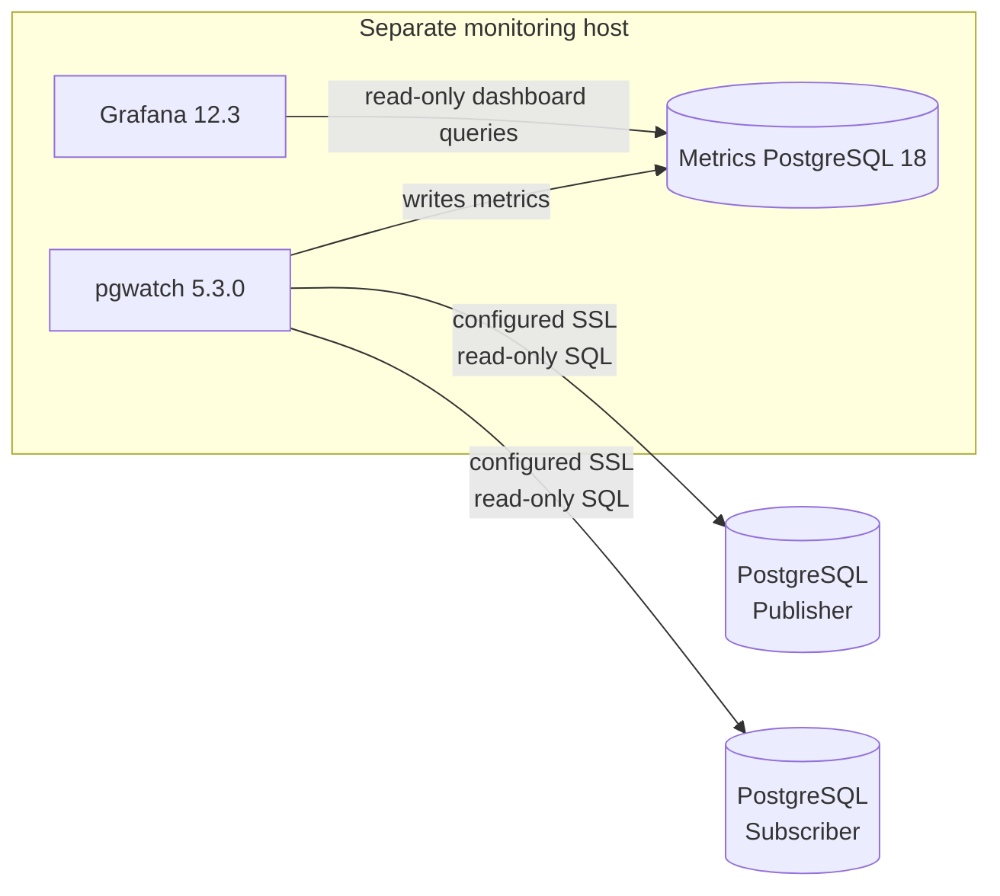

# PostgreSQL Logical Replication Migration Monitoring

A monitoring-only pgwatch stack for a PostgreSQL publisher and subscriber. It
runs on a separate host, stores metrics in a private PostgreSQL 18 container,
and provisions Grafana with the dashboard **PostgreSQL Logical
Replication Migration**.

No query in this project drops, alters, resets, vacuums, or otherwise changes a
publisher or subscriber. Source and target connections enforce
`default_transaction_read_only=on`, a 5-second statement timeout, and a
1-second lock timeout.

## Architecture



Grafana binds to `GRAFANA_BIND_ADDRESS`, which defaults to `127.0.0.1`.
The pgwatch administrative UI remains on `127.0.0.1`, and the metrics
database has no host port. The Docker bridge is not marked internal because
pgwatch must reach the external database servers.

## Version assumptions

This project was checked on 2026-09-15 against the current stable pgwatch
release, **v5.3.0**. It deliberately does not use the archived pgwatch2 format
or the v6 beta. It uses the v5 YAML source and metric format, the supported
`cybertecpostgresql/pgwatch:5.3.0` image, Grafana 12.3, and
`postgres:18.6-alpine` for the internal sink.

Validation detects and prints each server's reported PostgreSQL version; it
does not reject a connection based only on the major version. Custom metric
SQL currently starts with PostgreSQL 17 catalog layouts and includes
PostgreSQL 18 variants for newer conflict counters. The validator executes the
queries against the connected servers, so an actually incompatible catalog
layout is reported as a SQL failure instead of a version allowlist failure.

References: [pgwatch v5.3.0 release](https://github.com/cybertec-postgresql/pgwatch/releases/tag/v5.3.0),
[pgwatch CLI/environment reference](https://pgwat.ch/latest/reference/cli_env/),
[PostgreSQL 17 replication-slot view](https://www.postgresql.org/docs/17/view-pg-replication-slots.html),
and [PostgreSQL 18 subscription statistics](https://www.postgresql.org/docs/18/monitoring-stats.html#MONITORING-PG-STAT-SUBSCRIPTION-STATS).

## Prerequisites

- Docker Engine with Docker Compose v2
- `psql`, `curl`, and `jq` on the monitoring host
- Python 3 and GNU `stdbuf` for the optional exact data validator
- Network access from the monitoring host to both PostgreSQL endpoints
- A CA certificate for each endpoint when using `verify-ca` or `verify-full`;
  `verify-full` also requires the certificate to match the configured host
- An administrator able to create the monitoring role on each cluster
- Existing publications, subscriptions, and slots; this project never creates
  or changes replication configuration

## Create the least-privilege monitoring role

Run these commands as an authorized administrator once on the **source
cluster** and once on the **target cluster**. Replace the password and database
name. Repeat only the `GRANT CONNECT` for each database monitored by that
cluster role.

```sql
CREATE ROLE pgwatch_monitor
  LOGIN
  PASSWORD '<LONG_RANDOM_PASSWORD>'
  NOSUPERUSER
  NOCREATEDB
  NOCREATEROLE
  NOREPLICATION;

GRANT pg_monitor TO pgwatch_monitor;
GRANT CONNECT ON DATABASE "appdb" TO pgwatch_monitor;
```

No superuser, replication attribute, ownership, schema privilege, or table
write privilege is needed. `pg_monitor` is needed to see complete statistics
for other backends, including WAL senders and subscription workers.
`pg_subscription.subconninfo` is intentionally never queried.

On a hardened installation that has revoked the normal public catalog access,
first run `./scripts/validate.sh` and inspect the exact permission error.
Only then consider narrow `SELECT` grants on the named system views/catalogs;
do not grant superuser, replication, database ownership, or broad application
schema access.

## Create the one-shot data-validation role

pgwatch itself does not compare application rows. For an exact post-migration
comparison, create a separate role on the source and target so continuous
monitoring never gains access to application data:

```sql
CREATE ROLE migration_validator
  LOGIN
  PASSWORD '<DIFFERENT_LONG_RANDOM_PASSWORD_ON_EACH_CLUSTER>'
  NOSUPERUSER
  NOCREATEDB
  NOCREATEROLE
  NOREPLICATION;

GRANT pg_monitor TO migration_validator;
GRANT CONNECT ON DATABASE "appdb" TO migration_validator;
GRANT USAGE ON SCHEMA app TO migration_validator;
GRANT SELECT ON TABLE app.example_table TO migration_validator;
```

Grant `USAGE` and `SELECT` only for the schemas and tables in the publication.
The validator fails closed if a table is unreadable; it never grants or changes
database privileges itself. Revoke or remove this role after validation under
your normal access-control process.

## Configure

```bash
cd pgwatch-logical-replication
cp .env.example .env
chmod 600 .env
```

Create the shared passfile referenced by `DB_PGPASSFILE_HOST` with one exact
entry for every source/target user:

```text
publisher.example.com:5432:appdb:pgwatch_monitor:<SOURCE_MONITOR_PASSWORD>
subscriber.example.com:5432:appdb:pgwatch_monitor:<TARGET_MONITOR_PASSWORD>
publisher.example.com:5432:appdb:migration_validator:<SOURCE_VALIDATION_PASSWORD>
subscriber.example.com:5432:appdb:migration_validator:<TARGET_VALIDATION_PASSWORD>
```

Use the same host, port, database, and username values configured in `.env`;
avoid wildcards. Escape `:` and `\` with a backslash as described in the
[PostgreSQL password-file documentation](https://www.postgresql.org/docs/current/libpq-pgpass.html).
Protect the file before starting the stack:

```bash
chmod 600 /absolute/path/to/.pgpass
```

Edit `.env`. Set real source/target hosts, database names, monitoring and
validation usernames, `DB_PGPASSFILE_HOST`, unique internal/Grafana passwords,
and each endpoint's SSL mode.
For `verify-ca` or `verify-full`, also provide an absolute readable CA path.
For exact data validation, set the publication and subscription; it uses the
same endpoint SSL modes.
The non-secret `migration_pair` values in `config/sources.yaml` correlate
the publisher and subscriber. Use a unique shared value for each migration
pair. pgwatch v5.3 expands environment variables in source names and
connection strings, but not in `custom_tags`, so this label is intentionally
set in YAML.

The scripts source `.env` as shell syntax. Single-quote values containing
`$`, `#`, spaces, or other shell metacharacters. A literal single quote in
a secret should be avoided or escaped using normal shell syntax. External
database passwords are not stored in `.env`, generated connection URLs, or
checked-in YAML.

The shared passfile is mounted read-only into the pgwatch container, so pgwatch
can read its validation entries. Keep it dedicated to this project and include
only the four required credentials.

Set `SOURCE_DB_SSLMODE` and `TARGET_DB_SSLMODE` independently. All standard
PostgreSQL modes are accepted:

- `verify-full`: encrypted, with CA and hostname verification.
- `verify-ca`: encrypted, with CA verification only.
- `require`: encrypted, without server identity verification.
- `prefer`, `allow`, or `disable`: encryption is not guaranteed.

`verify-full` remains the default. CA paths are required only for `verify-ca`
and `verify-full`; leave the corresponding `*_SSLROOTCERT_HOST` empty when no
CA is available. Startup warns when a selected mode lacks full verification.
Traffic inside the private Docker bridge uses `sslmode=disable`; that metrics
database is not exposed on a host port.

## Start

```bash
./scripts/start.sh
```

The exact sampling intervals are:

| Metric | Interval |
|---|---:|
| Publisher logical slots, byte lag, retained WAL | 10 seconds |
| Subscriber worker health and message age | 10 seconds |
| Apply/sync errors and PG18 conflicts | 15 seconds |
| Table synchronization state | 30 seconds |
| Replication origins | 30 seconds |
| Lightweight connectivity/general database totals | 60 seconds |

pgwatch is limited to one parallel connection per monitored database and
helper creation is disabled. Retention defaults to 30 days.

## Access Grafana

The safe default remains <http://127.0.0.1:3000>. To bind Grafana to the
requested VM address, set this in `.env` and restart the stack:

```env
GRAFANA_BIND_ADDRESS=10.220.0.161
```

Then open <http://10.220.0.161:3000> over the VPN and log in with
`GRAFANA_ADMIN_USER` / `GRAFANA_ADMIN_PASSWORD`. The pgwatch administrative
UI stays loopback-only.

The public address `203.156.65.173` is not assigned to this VM, so Docker
cannot bind it directly; public access would require upstream NAT/port
forwarding or a reverse proxy. Keep TCP port 3000 restricted to trusted VPN or
client addresses. If the connection is not protected by the VPN, keep
`GRAFANA_BIND_ADDRESS=127.0.0.1` and use an SSH tunnel:

```bash
ssh -L 3000:127.0.0.1:3000 user@203.156.65.173
```

Two dashboards are under **PostgreSQL Migrations**:

- **PostgreSQL Migration Fleet Overview** lists every correlated migration as
  `source instance → target instance`, database, latest lag, new errors in the
  last five minutes, table readiness, and cutover readiness. The instance names
  are the existing `SOURCE_PGWATCH_NAME` and `TARGET_PGWATCH_NAME` labels. Click
  a database name to open the matching detail dashboard.
- **PostgreSQL Logical Replication Migration** provides detailed charts and
  tables. Choose publisher, subscriber, subscription, and slot from its
  dashboard variables.

The overview requires five minutes of healthy history and metrics newer than
90 seconds before reporting `READY`. During that window the slot must remain
active and streaming, lag must remain zero, the enabled subscription must keep
an apply worker, apply/sync error counters must not increase or reset, and all
subscription tables must remain ready. A known failure is `BLOCKED`; missing,
stale, newly started, or incomplete data is `UNKNOWN`. Exact row validation is
still a separate manual cutover check and is not included in this status.

Nine suggested alert rules are provisioned **paused**, with no contact point.
They cover inactive required slots, missing apply workers, increasing
apply/sync errors, 10/20 GiB retained WAL, 1 GiB lag, 60-second message age,
and a non-ready count unchanged for 15 minutes. Review their scope and
notification routing before enabling them. Rules tied to subscriptions filter
on `subenabled`; an intentionally disabled subscription will not trigger
those rules.

## Validate

```bash
./scripts/validate.sh
```

Validation is read-only. It checks all three services, prints the detected
source and target versions, checks connectivity, runs all five standalone SQL
files, and verifies the Grafana datasource, dashboards, paused alerts, and
fresh metric rows. Allow up to two minutes for the first metric validation.

## Compare source and target data at cutover

The exact validator compares only full-row published tables with matching
schemas and primary keys. It does not put application rows in pgwatch, Grafana,
or the metrics database.

Run the command, then follow its write-pause prompt:

```bash
./scripts/validate-data.sh
```

The workflow is:

1. Preflight publication membership, subscription readiness, schemas, primary
   keys, and read privileges.
2. Pause and drain application writes, then type `PAUSED`.
3. The validator captures a source snapshot and cutoff LSN, waits for the
   subscriber to apply through that LSN, and captures a target snapshot.
4. When `SNAPSHOTS CAPTURED` appears, application writes may resume. Keep the
   validator running while it streams both stable snapshots.

For automation, pause writes first and use `--writes-paused`. Override the
default five-minute catch-up wait with `--catchup-timeout SECONDS` and the
report location with `--output PATH`.

Reports are owner-only JSON Lines files under `validation-reports/`. They
contain table names, primary keys, mismatch types, and changed column names,
but never differing values. Exit status `0` means equal, `1` means confirmed
row differences, and `2` means the comparison was incomplete or invalid.

This validates published table rows only. PostgreSQL logical replication does
not replicate DDL, sequence state, or large objects; audit those separately
before cutover. Keep target application writes disabled until migration
ownership transfers, or the comparison no longer represents replication alone.

## Add another database

Each pgwatch source is one database connection. For another migration pair:

1. Add uniquely named source/target variables to `.env`.
2. Add exact monitoring entries for both endpoints to the shared passfile; add
   validation-user entries too when exact comparison will be used.
3. Export two additional URL-encoded connection strings in
   `scripts/start.sh`, following the existing `build_db_uri` calls.
4. Append publisher and subscriber entries to `config/sources.yaml`, using
   unique `name` values and the new connection-string variables.
5. Give both entries the same new `migration_pair` tag.
6. Grant `CONNECT` on each added database to `pgwatch_monitor`.
7. Restart only the monitoring stack and validate.

Do not reuse a pgwatch `name`; it becomes the `dbname` label in the metrics
sink. The dashboard automatically discovers additional names. If many
databases are migrated, consider one migration pair per Compose project to
keep credentials and failure domains isolated; set a unique Compose project
name and host ports for each.

## Troubleshoot missing metrics

1. Run `./scripts/validate.sh`; it reports the failing layer.
2. Check `docker compose logs --since=10m pgwatch` without posting logs that
   may contain connection details.
3. Confirm `DB_PGPASSFILE_HOST` points to a readable mode-`0600` file and
   that its host, port, database, and username fields exactly match `.env`.
4. Verify DNS, firewall rules, and pg_hba.conf access for the monitoring role.
   For certificate verification modes, also check the CA path and certificate
   hostname.
5. Confirm `GRANT CONNECT` exists on the specific database and
   `pg_monitor` is granted.
6. Confirm a logical slot/subscription/table relation/origin actually exists.
   Empty system views legitimately produce no rows for that metric.
7. Check the metrics sink tables:

```bash
docker compose exec -T metrics-db psql -U "${METRICS_DB_USER}" \
  -d "${METRICS_DB_NAME}" -c '\dt'
```

8. Check provisioning logs with
   `docker compose logs --since=10m grafana`.

## Stop and clean up

Stop containers while preserving Grafana and metric history:

```bash
./scripts/stop.sh
```

Remove the monitoring containers, network, and the two monitoring-only volumes:

```bash
docker compose --env-file .env down --volumes
```

After the stack is down, it is safe to delete this project directory, its
`.env`, dashboard/configuration files, CA-file copies used only by this
monitoring host, a passfile created only for this project, and the Compose
volumes `metrics-data` and `grafana-data`.
Deleting the volumes permanently removes only monitoring history and Grafana
state.

**Never delete or change anything on PostgreSQL as part of cleanup.** In
particular, do not drop replication slots, publications, subscriptions,
replication origins, or the application databases; do not reset replication
statistics; do not alter/enable/disable subscriptions; do not change server
parameters; and do not restart PostgreSQL. Removing `pgwatch_monitor` is a
separate access-control decision and is not performed by these scripts.

## Known limitations

- Slot lag is a WAL byte distance, not transaction latency.
- `safe_wal_size = -1` represents PostgreSQL NULL (unbounded/unavailable).
- Origin counts/activity cover only the current database's subscription-managed
  `pg_<subscription_oid>` naming convention; PostgreSQL exposes origin
  progress but no universal active flag.
- A long-running table copy can keep the non-ready count unchanged and make
  the paused stagnation rule a false positive.
- Correlation assumes the target `subslotname` matches the publisher slot
  name and both sources share the correct `migration_pair` tag.
- Source/target client certificates are not configured; add read-only mounts
  and libpq `sslcert`/`sslkey` parameters if mutual TLS is required.
- Grafana and pgwatch UI are loopback-only; remote access needs an SSH tunnel
  or a separately secured reverse proxy.
- Exact data validation supports one full-row publication whose tables all have
  primary keys; row filters, column lists, keyless tables, DDL, sequences, and
  large objects are intentionally outside its scope.
